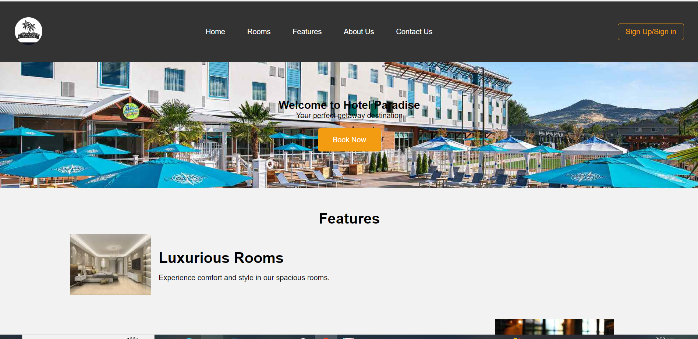

# Hotel Paradise Landing Page

Welcome to the Hotel Paradise Landing Page repository! This repository contains the HTML, CSS, and JavaScript code for a responsive landing page for a fictitious hotel named "Hotel Paradise."



## Overview

Hotel Paradise Landing Page is a responsive web page designed to showcase the features and offerings of the Hotel Paradise. The landing page includes sections for information about the hotel, its features, contact details, and a sign-up option. The page is designed to be visually appealing and user-friendly on various devices and screen sizes.

## Features

- **Responsive Design:** The landing page is designed to be responsive and adapt to different screen sizes, including desktops, tablets, and mobile phones.

- **Navigation:** A navigation bar provides easy access to different sections of the page, including Home, Rooms, Dining, About Us, Contact Us, and a Sign-Up option.

- **Feature Showcase:** The page includes a section that highlights the key features of the hotel, each accompanied by an image and a brief description.

- **Contact Information:** Users can find the hotel's contact information in the footer section, including email and phone details.


## Usage

1. Clone the repository:

   ```bash
   https://github.com/GhostRider1122/Landing_Page_Demo.git
